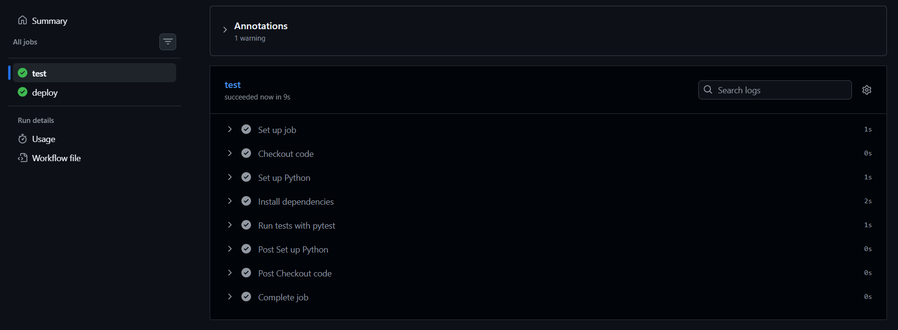
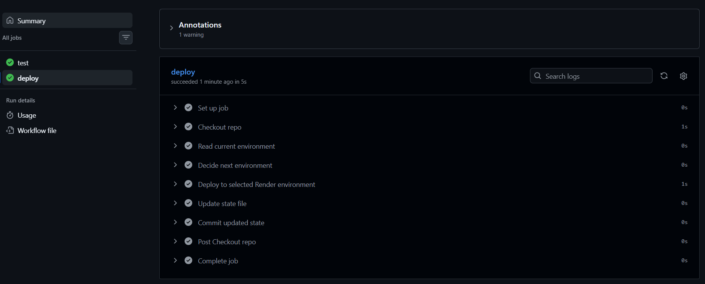
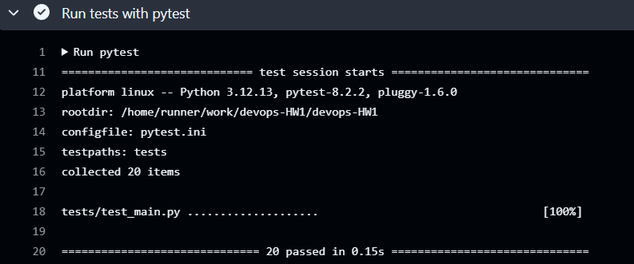
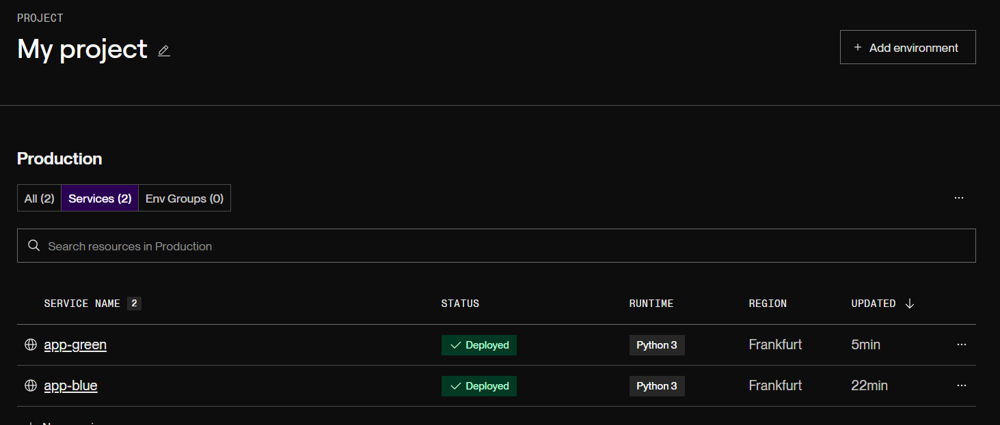
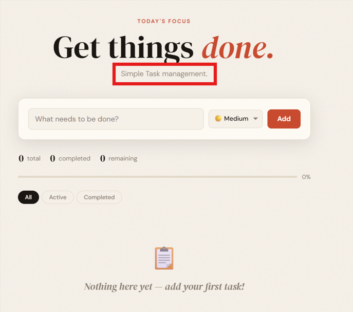
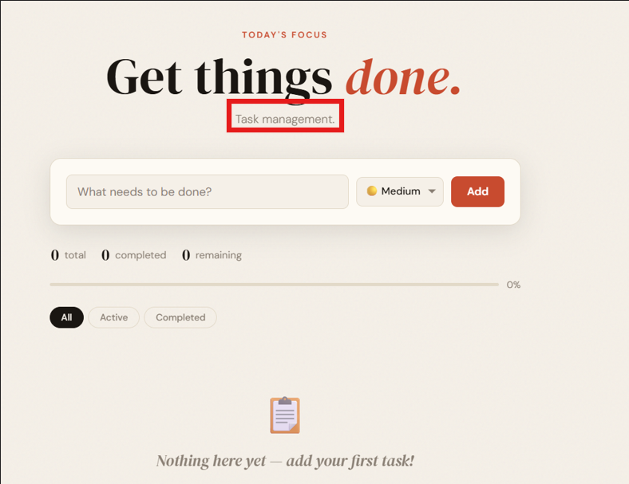

# DevOps CI/CD Pipeline Project

## Project Overview

This project demonstrates a complete DevOps workflow implementing Continuous Integration and Continuous Deployment (CI/CD) using GitHub Actions and a cloud deployment platform. The system automates the lifecycle of an application from code commit to production while ensuring reliability through automated testing and a Blue-Green deployment strategy.

The application is deployed on a free-tier cloud hosting platform - Render and is automatically updated after successful test execution.

---

## Live Application Links

Blue:
https://devops-hw1-lqtz.onrender.com

Green:
https://app-green.onrender.com

Hosted on: Render (https://render.com)

---

## Project Structure

```
devops-HW1/
├── .github/
│   └── workflows/
│       └── ci-cd.yml          # GitHub Actions CI/CD pipeline
├── app/
│   ├── templates/
│   │   └── index.html         # Frontend HTML template
│   └── main.py                # Flask application
├── tests/
│   └── test_main.py           # PyTest test file
├── .gitignore
├── pytest.ini                 # PyTest configuration
└── requirements.txt           # Python dependencies
```


---

## CI/CD Pipeline Overview

The pipeline is implemented using GitHub Actions and consists of two main stages:

### 1. Continuous Integration (CI)
- Triggered on every push to the `main` branch
- Installs dependencies from `requirements.txt`
- Runs automated tests using PyTest
- If tests fail, the deployment stage is blocked

### 2. Continuous Deployment (CD)
- Runs only if CI passes
- Reads `deploy-state.txt` to determine the last deployed environment
- The pipeline alternates deployments between Blue and Green environments using separate Render services.
- Deploys to Render using deploy hooks
- Updates the state file after deployment

---

## Deployment Strategy: Blue-Green (Simulated Implementation)

### Strategy Chosen

This project uses a Blue-Green deployment strategy implemented in a simplified form suitable for a free-tier cloud environment.

---

### Implementation / Simulation Details

The strategy is simulated using two separate deployment environments (Blue and Green) hosted on Render. Each deployment cycle alternates between these environments using a CI/CD pipeline.

The process works as follows:

1. Code is pushed to the `main` branch
2. GitHub Actions runs automated tests (CI stage)
3. If tests pass, the deployment stage is triggered
4. The pipeline deploys to the inactive environment (Blue or Green)
5. The previously deployed environment remains available as a stable fallback

Instead of performing live traffic switching through infrastructure-level routing, the simulation treats each environment as an independent production version and switches between them via deployment selection logic.

---

### Why this strategy was chosen:
- Ensures safe deployments with minimal risk
- Provides instant rollback capability
- Prevents downtime during updates
- Works well with free-tier cloud hosting limitations

---

## Rollback Protocol

If a bug is discovered in production:

### Step 1
Identify which environment is currently live (Blue or Green)

### Step 2
Switch traffic to the previously stable environment:
- If Green is broken, use Blue
- If Blue is broken, use Green

### Step 3
Verify the previous version is working correctly

### Step 4
Fix the issue and redeploy through the CI/CD pipeline

Rollback is achieved by switching between environments rather than redeploying immediately. 
This approach ensures a fast rollback without redeploying the application.

---

## CI/CD Pipeline Summary

- GitHub Actions handles automation
- Tests must pass before deployment
- Deployment is triggered via Render deploy hooks
- Blue-Green strategy ensures safe release management
- Deployment state is tracked using `deploy-state.txt`

---

## Screenshots Required

### 1. GitHub Actions Successful Pipeline
- CI passing (tests successful)



- Deployment job executed successfully



### 2. Test Execution Logs
- PyTest running and passing



### 3. Render Dashboard



- Blue Service (Before update)



- Green Service (After update)




---

## Technologies Used

- Python
- PyTest
- GitHub Actions
- Render
- Flask 
